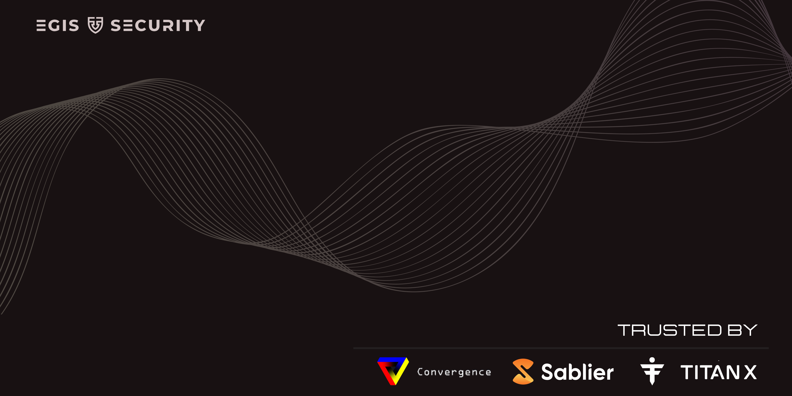
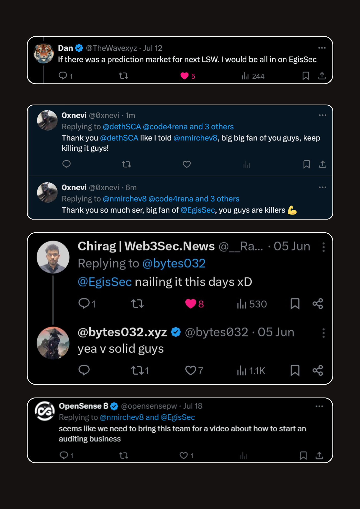
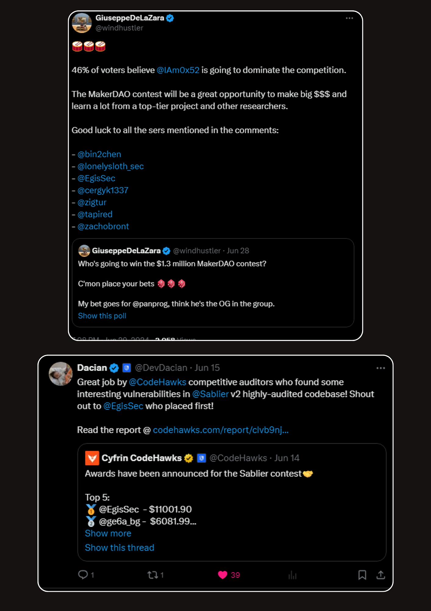

    

## About us - [Website](https://www.egissec.com/)

We are a team of experienced smart contract researchers, who strive to provide the best smart contract security services possible to DeFi protocols.

All members of [Egis Security](https://twitter.com/EgisSec) have a proven track record on public auditing platforms such as Code4rena, Sherlock & Codehawks, uncovering more than 150 High/Medium severity vulnerabilities, securing millions of dollars on-chain.

## Book us

If you are looking for experienced smart contract auditors to secure your protocol, you can contact us at:

- [**Twitter**](https://twitter.com/dethSCA)
- [**Telegram**](https://t.me/dethSCA)
- [**Discord**](https://discordapp.com/users/348387992974393355)

### Core Team 
- [nmirchev8](https://twitter.com/nmirchev8) - Founder & Lead Security Researcher
- [deth](https://twitter.com/dethSCA) - Founder & Lead Security Researcher

## Our Work
### Private Engagements
| №  | Date    |  Protocol                                      | Findings                   | Report     |     Type |
|--- |---------|-----------------------------------------------|-----------------------------|------------|----------|
| 14. | 11.2024 | [Soon](Soon) | Soon | Soon | Soon |
| 13. | 11.2024 | [Element369](https://docs.helios-hlx.win/element-369/) | 2H, 2M, 2L, 1i | [Open](./reports/Element369.pdf) | Reward Distribution, NFT |
| 12. | 10.2024 | [Vyper](None) | 2M, 4L, 4i | [Open](./reports/Vyper.pdf) | Auction, ERC20 |
| 11. | 10.2024 | [Lotus](https://x.com/LotusXDeFi) | 2H, 4M, 3L, 8i | [Open](./reports/Lotus.pdf) | Auction, ERC20, Staking |
| 10. | 10.2024 | [Element280](https://docs.helios-hlx.win/element280) | 1C, 1H, 2M, 3L, 13i | [Open](./reports/Element280.pdf) | Auction, ERC20, BuyAndBurn |
| 9. | 09.2024 | [Convergence](https://x.com/Convergence_fi) | 2M, 5L, 7i | [Open](./reports/Convergence.pdf) | Staking |
| 8. | 09.2024 | [Volt](https://docs.volt.win/) | 1H, 7L, 1i | [Open](./reports/Volt.pdf) | ERC20, Auction |
| 7. | 09.2024 | [Flux](https://flare-4.gitbook.io/flux-protocol) | 1C, 3M, 10L, 4i | [Open](./reports/Flux.pdf) | ERC20, Staking, Auction |
| 6. | 07.2024 | [Inferno](https://docs.inferno.win/inferno) | 4M, 4L, 6i | [Open](./reports/Inferno.pdf) | ERC20, BuyAndBurn |
| 5. | 06.2024 | [Sablier V2 Mitigation](https://sablier.com/) | 1M, 2L, 1i | [Open](./reports/SablierMitigation.pdf) | Token Distribution |
| 4. | 06.2024 | [Blaze](https://www.titanblaze.win/) | 1C, 2H, 4M, 10L, 9i | [Open](./reports/Blaze.pdf) | Game-fi, Staking |
| 3. | 04.2024 | [Trotel Coin V2](https://www.trotelcoin.com/) | 1C, 1H, 3M, 10L, 1i        |[Open](./reports/Trotel-coin-v2.pdf) | Game-fi, Staking | 
| 2. | 04.2024 | [Trotel Coin V1](https://www.trotelcoin.com/) | 4C , 1H, 1M , 1L           |[Open](./reports/Trotel-coin-v1.pdf) | Game-fi, Staking | 
| 1. | 03.2024 | [Lambdalf ERC Ethereum Contracts](https://github.com/lambdalf-dev/ethereum-contracts) | 1H , 3M , 2L |[Open](./reports/Lambdalf-contracts.pdf) | ERC721, ERC1155 library | 

### Public Competitions

| № | Date | Protocol |  Findings | Report | Type | Competition Platform | More Details |
|--------|----------|------|-------------|-----------|------|------|------|
| 20. | 11.2024 | [C4 Invitational](https://code4rena.com/audits/2024-10-audit-459-invitational) | Soon | Soon | ERC20 | Code4rena |  |
| 19. | 10.2024 | [Ulti Invitational](https://code4rena.com/audits/2024-08-basin-invitational) | Soon | Soon | ERC20 | Code4rena | 🥈 place |
| 18. | 08.2024 | [Basin Mitigation](https://code4rena.com/audits/2024-08-basin-invitational) | 1 М | Soon | Stableswap | Code4rena | 🥇 place |
| 17. | 08.2024 | [Sentiment V2](https://audits.sherlock.xyz/contests/349) | 1H, 8M | [Open](https://audits.sherlock.xyz/contests/349?filter=results) | Lending/Borrowing | Shrelock | |
| 16. | 07.2024 | [Basin](https://code4rena.com/audits/2024-07-basin) | 1H, 2M | [Open](https://code4rena.com/reports/2024-07-basin) | Stableswap | Code4rena | 🥇 place |
| 15. | 07.2024 | [Chainlink CCIP](https://codehawks.cyfrin.io/c/2024-07-CL-CCIP) | 1M, 4L | Private | Cross-chain | Code Hawks | 🥈 place, Best coverage overall|
| 14. | 06.2024 | [Palmera](https://app.hats.finance/audit-competitions/palmera-0x5fee7541ddcd51ba9f4af606f87b2c42eea655be/rewards) | 2M | [Open](https://github.com/hats-finance/Palmera-0x5fee7541ddcd51ba9f4af606f87b2c42eea655be/labels/medium) | Account Abstraction | Hats | 🥈 place |
| 13. | 06.2024 | [Inverter](https://app.hats.finance/audit-competitions/inverter-network-0xe47e52c4fea05e555920f1dcdcc6fb8eca103eeb/rewards) | 7M, 6L | [Open](https://github.com/hats-finance/Inverter-Network-0xe47e52c4fea05e555920f1dcdcc6fb8eca103eeb/labels/medium) | No-code token framework |  Hats | 🥇 place |
| 12.  | 05.2024 | [Sablier](https://www.codehawks.com/contests/clvb9njmy00012dqjyaavpl44) | 4M | [Open](https://codehawks.cyfrin.io/c/2024-05-Sablier/results?lt=contest&page=1&sc=reward&sj=reward&t=report) | Token Distribution |  Code Hawks |🥇 place, 100% H/M found |
| 11. | 05.2024 | [Gama](https://audits.sherlock.xyz/contests/330) | 1M | [Open](https://audits.sherlock.xyz/contests/330/report) | Staking |  Sherlock | 🥉 place |
| 10.  | 05.2024 | [Аave](https://cantina.xyz/competitions/5ffcedec-7e2e-4717-a3e4-e9041ca541c2) | 1 L | [Open](./reports/competitions/aave.md) | 3.1 update |  Cantina | Top 10 |
| 9.  | 05.2024 | [Sophon](https://audits.sherlock.xyz/contests/376) | 2H, 1M | [Open](https://audits.sherlock.xyz/contests/376/report) | Staking/Farming |  Sherlock |🥇 place |
| 8.  | 05.2024 | [Optimism](https://cantina.xyz/competitions/d47f8096-8858-437d-a9f5-2fe85ac9b95e) | 2 М | [Open](https://cantina.xyz/portfolio/1b6a9e55-49a8-46e9-8272-a849fd60fcc4) | Gnosis Safe Integration |  Cantina | Тop 10 |
| 7.  | 05.2024 | [Ion](https://x.com/ShieldifySec/status/1785231013376876595) | 1M | [Open](./reports/competitions/ion.md) | Lending/Borrowing |   Sheldify | 🥇 place, the only valid M |
| 6.  | 05.2024 | [Convergence](https://x.com/ShieldifySec/status/1788133361917034993) | 1M, 1L | [Open](./reports/competitions/convergence.md) | Yield, Staking |   Hats Finance | 🥇 place|
| 5.  | 04.2024 | [Posseum](https://x.com/ShieldifySec/status/1788133361917034993) | 1H, 1L | [Open](./reports/competitions/posseum.md) | Yield |   Sheldify | 🥈 place|
| 4. | 04.2024 | [Venus](https://cantina.xyz/competitions/ddf86a5c-6f63-430f-aadc-d8742b4b1bcf) | 1M | [Open](./reports/competitions/venus.md)| Cross-chain Governance | Cantina |🥈 place, 100% H/M found |
| 3. | 04.2024 | [Dyad](https://code4rena.com/audits/2024-04-dyad#top) |  5H, 5M | [Open](https://code4rena.com/reports/2024-04-dyad) | Stablecoin | Code4rena| Top 20 |
| 2. | 04.2024 | [Teller](https://audits.sherlock.xyz/contests/295) | 10H, 6M | [Open](https://audits.sherlock.xyz/contests/295/report)| Lending/Borrowing | Sherlock| 🥇 place 10/12 H's found |
| 1. | 04.2024| [Goat Finance](https://cantina.xyz/competitions/f214cf86-cc80-40c0-a70b-e9bb25d7ac80)|  5M, 6H | [Open](https://cantina.xyz/portfolio/404911dd-3a50-4b63-90d4-e0b9164a34a5) | SocialFi | Cantina | 4th place|

### Members Individual Work - [nmirchev8](https://github.com/NicolaMirchev/audits) | [deth](https://github.com/0xdeth)

---

## Community about us

    

    

