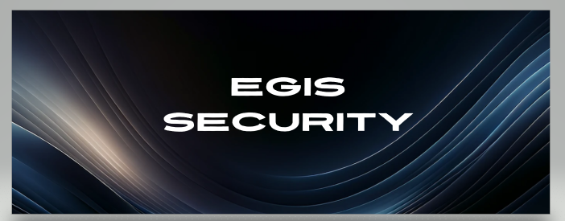

# Egis Security

---

## Team Members

### [nmirchev8](https://twitter.com/nmirchev8) - Security Researcher

nmirchev8 is a smart contract security researcher with expertise in solidity manual audits. He has contributed secure various protocols through public contests, participated as a researcher in reviews with firms such as Guardian Audits and has conducted solo audits for projects.

#### Recent Work

- Participated as security researcher with Guardian Audits
- Participated in many public contests. Multiple top 10 rankings.
- Conducted a few solo audits.

---

### [deth](https://twitter.com/dethSCA) - Security Researcher

nmirchev8 is a smart contract security researcher with expertise in solidity manual audits. He has contributed secure various protocols through public contests, participated as a researcher in reviews with firms such as Guardian Audits and has conducted solo audits for projects.

#### Recent Work

- Led a successful investigation into a sophisticated ransomware attack on a Fortune 500 company.
- Succesfull bug hunter with multiple bounties
- Collaborated with law enforcement agencies to dismantle a cybercrime syndicate.

---

| nmirchev8 | deth |
|-----------------------|-----------------------|
| [MorpheusAI - 1H - 02.2024](https://github.com/NicolaMirchev/audits/blob/main/contests/codehawks/morpheusAi.md) | [Audit Report Y](link_to_report_y) |
| [Decent - 2H, 2M - 01.2024](https://github.com/NicolaMirchev/audits/blob/main/contests/codearena/decent.md) | [Audit Report Y](link_to_report_y) |
| [Opus - 1H - 01.2024](https://github.com/NicolaMirchev/audits/blob/main/contests/codearena/opus.md) | [Audit Report Y](link_to_report_y) |
| [The Standard - 2M, 1L - 12.2023](https://github.com/NicolaMirchev/audits/blob/main/contests/codehawks/theStandard.md) | [Audit Report Y](link_to_report_y) |
| [Revolution - 4M - 12.2023](https://github.com/NicolaMirchev/audits/blob/main/contests/codearena/revolution.md) | [Audit Report Y](link_to_report_y) |
| [Ethereum Credit Guild - 2H, 2M - 12.2023](https://github.com/NicolaMirchev/audits/blob/main/contests/codearena/creditGuild.md) | [Audit Report Y](link_to_report_y) |
| [Kelp DAO - 1M - 11.2023](https://github.com/NicolaMirchev/audits/blob/main/contests/codearena/KelpDao.md) | [Audit Report Y](link_to_report_y) |
| [Canto Bonding Curves - 1M - 11.2023](https://github.com/NicolaMirchev/audits/blob/main/contests/codearena/canto1155s.md) | [Audit Report Y](link_to_report_y) |
| [SteadyFi - 3M, 1L - 10.2023](https://github.com/NicolaMirchev/audits/blob/main/contests/codehawks/steadefi.md) | [Audit Report Y](link_to_report_y) |
| [Open Dollar - 3M - 10.2023](https://github.com/NicolaMirchev/audits/blob/main/contests/codearena/opendollar.md) | [Audit Report Y](link_to_report_y) |
| [Centifuge - 1M - 09.2023](https://github.com/NicolaMirchev/audits/blob/main/contests/codearena/centifuge.md) | [Audit Report Y](link_to_report_y) |
| [Cooler Update - 1H, 1M, - 08.2023](https://github.com/NicolaMirchev/audits/blob/main/contests/sherlock/cooler.md) | [Audit Report Y](link_to_report_y) |
| [SparkN - 1H, 1M, 2L - 08.2023](https://github.com/NicolaMirchev/audits/blob/main/contests/codehawks/sparkn.md) | [Audit Report Y](link_to_report_y) |
| [BeedleFi - 2H, 2L - 07.2023](https://github.com/NicolaMirchev/audits/blob/main/contests/codehawks/beedlefi.md) | [Audit Report Y](link_to_report_y) |
| [DeFi Stablecoin CodeHawks - 2M, 2L - 07.2023](https://github.com/NicolaMirchev/audits/blob/main/contests/codehawks/stablecoin.md) | [Audit Report Y](link_to_report_y) |

#### Key Features

- End-to-end high quality manual review.
- PPV (pay-per-vulnerability) model with fixed base pay.
- Free initial review + mitigation call after the audit

## Contact Us

Thank you for exploring our portfolio! If you have any inquiries or collaboration opportunities, feel free to reach out to us:

- ** Telegram:** []

We look forward to hearing from you!
